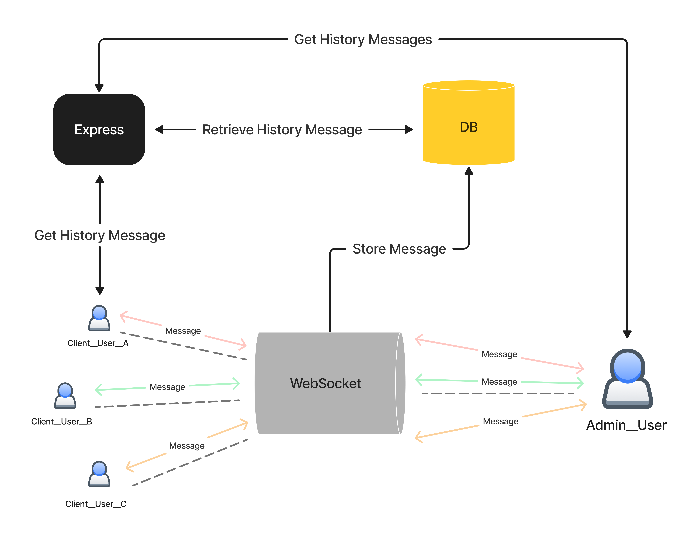

# Chat Room Feature in STYLiSH

## Table of Contents

- [📹 Demo](#demo)
- [💻 Tech Stack](#tech-stack)
- [⚙️ Architecture](#system-architecture)

## Demo

## Tech Stack

### Back-End:

### Cloud Service(AWS):

## System Architecture

